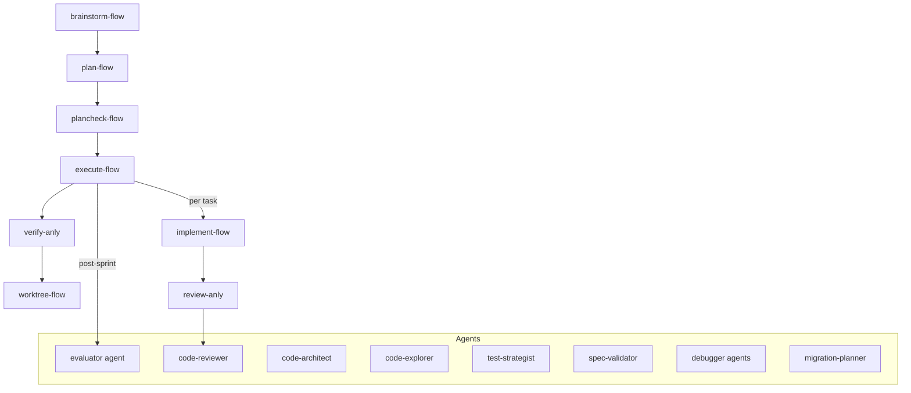

# magnusprot

Personal skill suite for Claude Code — workflow orchestration, TDD-first development, systematic debugging, multi-perspective code review, and system utilities.

---

## Install

**Claude Code plugin (marketplace):**

```bash
# 1. Register marketplace
/plugin marketplace add cyanprot/magnusprot

# 2. Install plugin
/plugin install magnusprot@magnusprot
```

**Local (no install):**

```bash
claude --plugin-dir ~/magnusprot
```

---

## Architecture



---

## Skills (23)

Skills are namespaced as `/magnusprot:<skill-name>` when installed as a plugin.

### Model Tiers

| Tier | Model | Skills |
|------|-------|--------|
| **Light** | `haiku` | clean-dev, commit-dev, deps-dev, docs-dev, init-dev |
| **Medium** | `sonnet` | explain-anly, healthcheck-dev, perf-anly, respond-anly, research-sys, security-dev, worktree-flow |
| **Heavy** | inherit | brainstorm-flow, debug-anly, execute-flow, implement-flow, plan-flow, plancheck-flow, review-anly, session-handoff, simplify-anly, skilldev-sys, verify-anly |

### Core Workflow Chain

`brainstorm-flow` &rarr; `plan-flow` &rarr; `plancheck-flow` &rarr; `execute-flow` &rarr; `verify-anly`

Supporting: `implement-flow`, `review-anly`, `worktree-flow`

### Analysis & Review

| Skill | Description |
|-------|-------------|
| `review-anly` | 7-perspective code quality analysis |
| `explain-anly` | Code structure, functions, and call graph explanation |
| `simplify-anly` | Complexity audit — dead code, DRY, YAGNI, coupling |
| `perf-anly` | Performance analysis — bottlenecks, complexity, N+1 queries |
| `respond-anly` | Code review feedback response — verify before agreeing |
| `verify-anly` | Plan compliance + execution evidence gate |

### Development

| Skill | Description |
|-------|-------------|
| `init-dev` | Project context loading — scan configs, deps, git state |
| `commit-dev` | Auto-format as Conventional Commits |
| `clean-dev` | System cleanup (multi-distro: apt/dnf) |
| `deps-dev` | Dependency status and security audit |
| `docs-dev` | Documentation generation and audit |
| `security-dev` | Security vulnerability scanning — secrets, injection, unsafe APIs |
| `healthcheck-dev` | Project health verification — parallel build, runtime, docs checks |

### Workflow

| Skill | Description |
|-------|-------------|
| `brainstorm-flow` | Requirements exploration — shape design before implementation |
| `plan-flow` | TDD plan + campaign/sprint contracts |
| `plancheck-flow` | Plan review — catch over-engineering and scope creep |
| `execute-flow` | Plan execution — batch or subagent mode with campaign tracking |
| `implement-flow` | TDD-first implementation — strict red-green-refactor |
| `worktree-flow` | Git worktree lifecycle — setup, develop, merge/PR |

### System & Utilities

| Skill | Description |
|-------|-------------|
| `debug-anly` | Root cause analysis before fixing |
| `research-sys` | API/library investigation with structured findings |
| `session-handoff` | Session wrap-up — save progress, update memory, summarize |
| `skilldev-sys` | Skill creation and testing — TDD skill development |

---

## Agents (9)

| Agent | Description |
|-------|-------------|
| `code-reviewer` | Plan-aligned review with 7-perspective framework |
| `code-architect` | System design evaluation and structural trade-offs |
| `code-explorer` | Deep codebase exploration and execution path tracing |
| `evaluator` | Black-box live-app testing via Playwright (4-phase: happy path, edge cases, mobile, regression) |
| `silent-failure-hunter` | Finds bugs that don't throw errors — empty results, missing data, swallowed exceptions |
| `incident-investigator` | Error chain tracing for loud failures — stack traces, crash analysis |
| `test-strategist` | Test design — edge cases, coverage gaps, test architecture |
| `migration-planner` | Version upgrades and API deprecation response |
| `spec-validator` | Requirements compliance validation against specs/PRDs |

---

## Campaign System

magnusprot supports multi-session project campaigns via `.claude/campaign.json`:

- **plan-flow** generates campaign state + sprint contracts
- **execute-flow** resumes campaigns across sessions (reads `continuation_prompt`)
- **verify-anly** validates sprint contract compliance (Gate 3)
- **evaluator** agent runs Playwright black-box testing post-sprint

Sprint contracts are stored in `.claude/sprint-contracts/<project>-<N>.json`.

---

## Multi-distro Support

`clean-dev` detects the package manager at runtime (`dnf`/`apt`) and adapts commands accordingly. Includes Pop!_OS safety features: NVIDIA/GPU package protection, sudo policy detection, generic-hwe kernel protection.

---

## License

[MIT](LICENSE)
