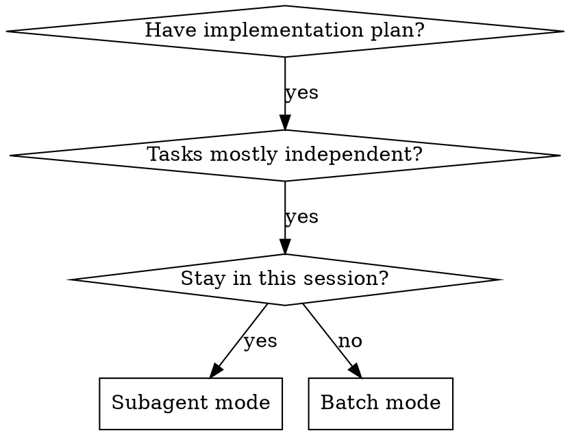
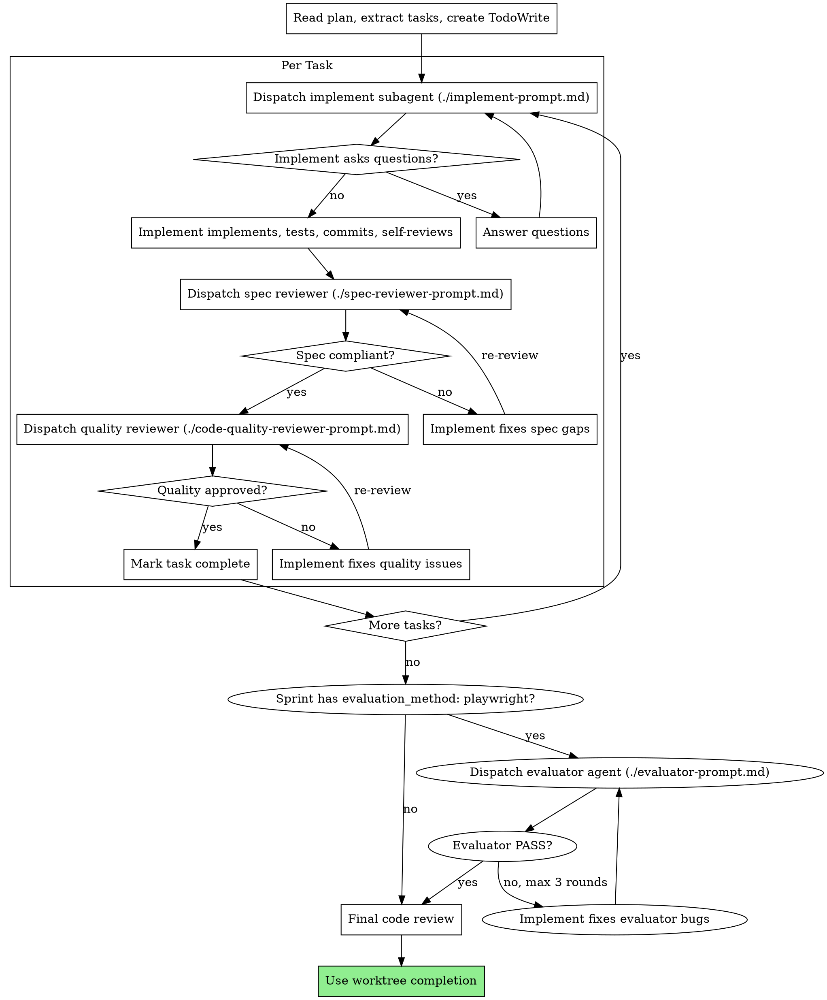

# Plan Execution

## Overview

Two execution modes for implementation plans:

- **Batch Mode:** Execute tasks in batches of 3, report for review between batches. Best for separate sessions.
- **Subagent Mode:** Dispatch fresh subagent per task with two-stage review (spec then quality). Best for same-session execution.

**Announce at start:** "I'm using the execute-flow skill to implement this plan."

---

## Common Prerequisites

### Step 0: Campaign Resume Check

Before anything else, check for active session state in this order:

1. **Read `.remember/remember.md`** (if exists) — last session's handoff note. Surfaces mid-task blockers, undocumented decisions, or WIP that never made it to `campaign.json`. Display verbatim.
2. **Read `.claude/campaign.json`** in the project root
3. **If campaign exists and `current_phase` is not `"complete"`:**
   - Load `continuation_prompt` — display it to orient context
   - Read the current sprint contract from `.claude/sprint-contracts/<project>-<current_sprint>.json`
   - Set `current_phase` to `"execute"` and save
   - Announce: "Resuming campaign: <project>, sprint <N>/<total>. <continuation_prompt>"
   - Skip to the current sprint's tasks in the plan
4. **If campaign not found or `current_phase` is `"complete"`:** proceed normally (no campaign)

### On Mid-Sprint Pause or Blocker

When the user pauses, a blocker appears, or context is about to be lost (compaction, session end):

1. Update `campaign.json` `continuation_prompt` with current state
2. **Invoke `/remember`** — writes `.remember/remember.md` with forward-looking handoff. Captures nuances `campaign.json` can't: open questions, reviewer feedback pending, local env quirks.
3. Announce pause point to user with specific resume instruction

### After Each Sprint Completes

Update `.claude/campaign.json`:
- Append sprint number to `completed_sprints`
- Increment `current_sprint`
- Update `continuation_prompt` with current state (what's done, what's next, server port, etc.)
- Log any architectural decisions to `decisions_log`

### On All Sprints Complete

Set `current_phase` to `"complete"` in `campaign.json`.

### Before Starting Either Mode

1. Set up isolated workspace using `worktree-flow` skill
2. Never start implementation on main/master branch without explicit user consent

---

## Batch Mode (Separate Session)

### Step 1: Load and Review Plan
1. Read plan file
2. Review critically -- identify any questions or concerns
3. If concerns: Raise them with your human partner before starting
4. If no concerns: Create TodoWrite and proceed

### Step 2: Execute Batch
**Default: First 3 tasks**

For each task:
1. Mark as in_progress
2. Follow each step exactly (plan has bite-sized steps)
3. Run verifications as specified
4. Mark as completed

### Step 3: Report
When batch complete:
- Show what was implemented
- Show verification output
- Say: "Ready for feedback."

### Step 4: Continue
Based on feedback:
- Apply changes if needed
- Execute next batch
- Repeat until complete

### Step 5: Complete Development
After all tasks complete and verified:
- **REQUIRED:** Use `worktree-flow` skill (Phase 2: Completion) to finish the branch

---

## Subagent Mode (Same Session)

Execute plan by dispatching fresh subagent per task, with two-stage review after each: spec compliance review first, then code quality review.

**Core principle:** Fresh subagent per task + two-stage review (spec then quality) = high quality, fast iteration

### When to Use Subagent Mode

### The Subagent Process

### Prompt Templates

- `./implement-prompt.md` - Dispatch implement subagent
- `./spec-reviewer-prompt.md` - Dispatch spec compliance reviewer subagent
- `./code-quality-reviewer-prompt.md` - Dispatch code quality reviewer subagent
- `./evaluator-prompt.md` - Dispatch evaluator agent for live-app testing

---

## Evaluator Dispatch (Post-Sprint)

After ALL tasks in a sprint pass spec and quality review, run live-app evaluation if the sprint contract calls for it.

### When to Run

Check the sprint contract's `evaluation_method` field:
- `"playwright"` → dispatch evaluator agent
- `"unit"` or `"manual"` → skip evaluator, proceed normally
- Field missing → skip evaluator

### Dispatch Process

1. **Ensure dev server is running.** Ask the user for the URL if not known. Do NOT start a server yourself in subagent mode.
2. **Dispatch `evaluator` agent** using `./evaluator-prompt.md` template:
   - Paste the full sprint contract JSON (not a file path)
   - Include the dev server URL
   - Describe any pre-existing state (test accounts, seeded data, navigation path)
3. **Read the verdict:**
   - **PASS** → proceed to mark sprint complete, update campaign.json
   - **PASS WITH WARNINGS** → log warnings, proceed (warnings go into campaign decisions_log)
   - **FAIL** → route bug report back to implement subagent for fix

### Retry on FAIL

1. Implement subagent receives the evaluator's bug report and fixes the issues
2. Re-run spec reviewer (quick pass) and quality reviewer
3. Re-dispatch evaluator
4. **Max 3 evaluator rounds.** After 3 FAILs, escalate to user with the full bug report:
   - "Evaluator failed 3 times. Here's the latest bug report: [report]. Please review and advise."

### Evaluator Scope

The evaluator is a **black-box tester** — it uses only Playwright browser tools, never reads source code. This separation ensures the evaluation is genuine user-perspective testing, not code inspection.

---

## When to Stop and Ask for Help

**STOP executing immediately when:**
- Hit a blocker mid-batch (missing dependency, test fails, instruction unclear)
- Plan has critical gaps preventing starting
- You don't understand an instruction
- Verification fails repeatedly

**Ask for clarification rather than guessing.**

## Red Flags

**Never:**
- Start implementation on main/master without explicit user consent
- Skip reviews (spec compliance OR code quality) in subagent mode
- Proceed with unfixed issues
- Dispatch multiple implementation subagents in parallel (conflicts)
- Make subagent read plan file (provide full text instead)
- Skip review loops (reviewer found issues = implement fixes = review again)
- **Start code quality review before spec compliance passes** (wrong order)

**If subagent asks questions:**
- Answer clearly and completely
- Provide additional context if needed
- Don't rush them into implementation

**If reviewer finds issues:**
- Implementer (same subagent) fixes them
- Reviewer reviews again
- Repeat until approved

## Integration

**Required workflow skills:**
- **worktree-flow** - Set up isolated workspace before starting, complete branch after all tasks
- **plan-flow** - Creates the plan this skill executes
- **review-anly** - Code review template for reviewer subagents

**Subagents should use:**
- **implement-flow** - Follow TDD for each task

**Quality gates:**
- **plancheck-flow** - Review plan before execution
- **verify-anly** - Verify work before claiming completion
- **evaluator** agent - Live-app Playwright testing (when `evaluation_method: "playwright"`)
