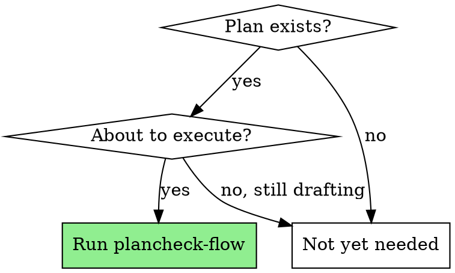

# Reviewing Plans

## Overview

Systematic review of implementation plans before execution. Catches problems that are 10x cheaper to fix in the plan than in code.

**Core principle:** Every plan must pass structured review before a single line of code is written. The reviewer must be a separate agent or a separate review pass — never the same context that wrote the plan.

## When to Use



- Plan written by `plan-flow` or any agent
- Before `execute-flow` begins
- When user hands you someone else's plan to evaluate
- When you suspect a plan has issues but can't articulate why

## The Review Process

**Dispatch a review subagent** (never self-review in the same context):

```
Task tool (general-purpose):
  description: "Review plan: [plan name]"
  prompt: |
    [Full plan text]
    [Original user request]
    [The Review Checklist below]
```

<HARD-GATE>
The reviewer MUST read the actual source files referenced in the plan. A plan review based only on the plan text is worthless — the plan can claim anything. Verify every claim against real code.

Self-review is forbidden. If you wrote the plan, dispatch a subagent to review it. If you received a plan from another agent, you may review it directly.
</HARD-GATE>

## Review Checklist

### 1. Scope Alignment

Compare plan against the original user request, word by word.

| Check | Ask |
|-------|-----|
| **Unrequested work** | Does each task directly serve the original request? |
| **Gold plating** | Are there "nice to have" features the user didn't ask for? |
| **Premature abstraction** | Interfaces, factories, registries for a single implementation? |
| **New packages/modules** | Is a new file/package justified, or does existing structure suffice? |
| **Scope ratio** | Would you explain every task to the user and they'd nod? |

**Red flag phrases in plans:**
- "improve overall reliability" (vague scope expansion)
- "refactor for better separation of concerns" (architecture astronautics)
- "add comprehensive monitoring" (unbounded scope)
- "while we're at it" (classic scope creep)
- "future-proof" / "extensible design" (YAGNI violation)
- "add proper error handling" (often means wrapping symptoms in try/except)

### 2. Root Cause Analysis

**The most critical check.** Bad plans treat symptoms, not causes.

| Check | Ask |
|-------|-----|
| **Cause identified?** | Does the plan state WHY the bug happens, with evidence? |
| **Evidence-based?** | Did the plan author read the relevant code, or guess? |
| **Fix targets cause?** | Does the fix address the stated cause, or work around it? |
| **Silent exception swallowing** | Any `except: pass` or `except Exception: pass`? |
| **Retry-as-fix** | Adding retries instead of fixing why it fails? |
| **Flag/config-as-fix** | Adding a toggle instead of fixing the logic? |

**Band-aid indicators:**
- `try/except` around the symptom instead of fixing the cause
- Retry loops for operations that shouldn't fail
- "Gracefully handle" = silently ignore
- New wrapper that catches and hides errors from the real module

### 3. Existing Code Awareness

| Check | Ask |
|-------|-----|
| **Already exists?** | Does the codebase already have this functionality? |
| **Pattern match** | Does the plan follow existing project patterns/conventions? |
| **Integration points** | Are modifications compatible with existing callers? |
| **Test coverage** | Does the plan account for existing tests that may break? |

### 4. Proportionality

| Check | Ask |
|-------|-----|
| **Files touched** | Is the number of new/modified files proportional to the ask? |
| **New dependencies** | Are new libraries/packages truly necessary? |
| **Config explosion** | Too many new configuration options for a simple fix? |
| **Blast radius** | How much existing code is disrupted? |

**Rule of thumb:** A bug fix should touch 1-3 files. If the plan touches 5+, justify each.

### 5. Executability

| Check | Ask |
|-------|-----|
| **Correct file paths** | Do referenced files actually exist? |
| **API accuracy** | Do code snippets use correct APIs/signatures? |
| **Ordering** | Are tasks in the right dependency order? |
| **Verifiable** | Does each task have a way to verify success? |

## Review Output Format

```markdown
## Plan Review: [Plan Name]

**Original Request:** [one line]
**Verdict:** PASS / PASS WITH CHANGES / REJECT

### Scope Issues
- [specific issue with task reference]

### Root Cause Issues
- [specific issue with evidence]

### Existing Code Conflicts
- [specific issue with file:line references]

### Proportionality Issues
- [specific issue with metrics]

### Recommended Changes
1. [specific actionable change]
2. [specific actionable change]

### Minimal Correct Plan (if REJECT)
[Brief outline of what the plan SHOULD look like]
```

## Verdicts

- **PASS**: Execute as-is
- **PASS WITH CHANGES**: Execute after specified modifications. List exact changes required.
- **REJECT**: Plan needs fundamental rework. **Minimal Correct Plan is MANDATORY** for REJECT verdicts — criticism without direction wastes everyone's time.

## Integration

**This skill slots into existing workflows:**

- **After** `plan-flow` generates a plan
- **Before** `execute-flow` begins
- Referenced by `execute-flow` Step 1 ("Load and Review Plan")

## Common Rationalizations for Skipping Review

| Excuse | Reality |
|--------|---------|
| "Plan is straightforward" | Straightforward plans have hidden scope creep |
| "I wrote it, I know it's good" | Self-review bias is real — you can't see your own blind spots |
| "Review slows us down" | Executing a bad plan wastes 10x more time |
| "It's just a small fix" | Small fixes with big plans = over-engineering |
| "The user wants speed" | The user wants correctness. Bad plans deliver neither |
| "I'll catch issues during execution" | Sunk cost bias makes mid-execution course corrections harder |
