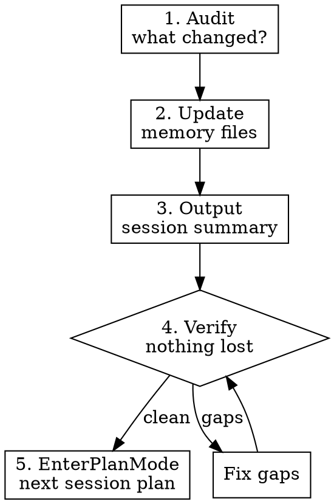

# Session Handoff

## Overview

End-of-session routine that persists progress to memory files and generates a self-contained handoff for the next session. Prevents the "what did we do last time?" problem.

## When to Use

- User signals session end ("정리해줘", "마무리", "wrap up")
- Significant milestone completed
- Before switching projects or contexts
- **NOT** mid-task — finish current work first

## Process



### 1. Audit Changes

- Files created, modified, or deleted
- Tools/packages installed or configured
- Learning progress (topic understanding changes)
- Decisions made, approaches chosen

### 2. Update Memory Files

**Read before writing** — update existing entries, don't duplicate.

| File | Content | Limit |
|------|---------|-------|
| `MEMORY.md` | Progress tables, status, phase, links | <200 lines |
| Topic files | Detailed notes per domain | No hard limit |
| Strategy files | Plans, approaches, timelines | Keep current |

**Rules:**
- Update status fields and understanding levels
- Remove stale/outdated entries
- Don't write session-specific temp state
- Don't write speculative conclusions — verify first

### 3. Output Session Summary

```
## Session Summary — [YYYY-MM-DD]

### Done
- [completed items, brief]

### Changed
- [files/configs modified and why]

### Open Items
- [unfinished work, blockers]

### Next Session
- [recommended starting point]
- [critical context to resume]
```

### 4. Verify

- Memory files saved successfully
- No TODOs or open items lost
- Handoff is **self-contained** — next session can start cold with just memory files

### 5. Enter Plan Mode

Summary 출력 후 **반드시 `EnterPlanMode`를 호출**하여 다음 세션 계획을 plan file에 작성한다.

Plan 내용:
- "Next Session" 항목 기반으로 구체적 실행 계획 작성
- Memory에서 현재 phase, understanding level 참조
- 다음 세션 시작 시 사용자가 **Enter만 치면 바로 실행** 가능하도록 작성

이렇게 하면 다음 세션에서:
1. Memory 읽기 → 현재 상태 파악
2. Plan 승인 (Enter) → 바로 학습/작업 시작

## Common Mistakes

| Mistake | Fix |
|---------|-----|
| Writing narrative instead of status updates | Use tables and bullets, not paragraphs |
| Forgetting to update understanding levels | Check topic map against what was learned |
| Dumping session logs into memory | Memory = conclusions, not history |
| Not noting blockers | Explicit "blocked by X" in open items |
| MEMORY.md over 200 lines | Move details to topic files, keep MEMORY.md as index |
