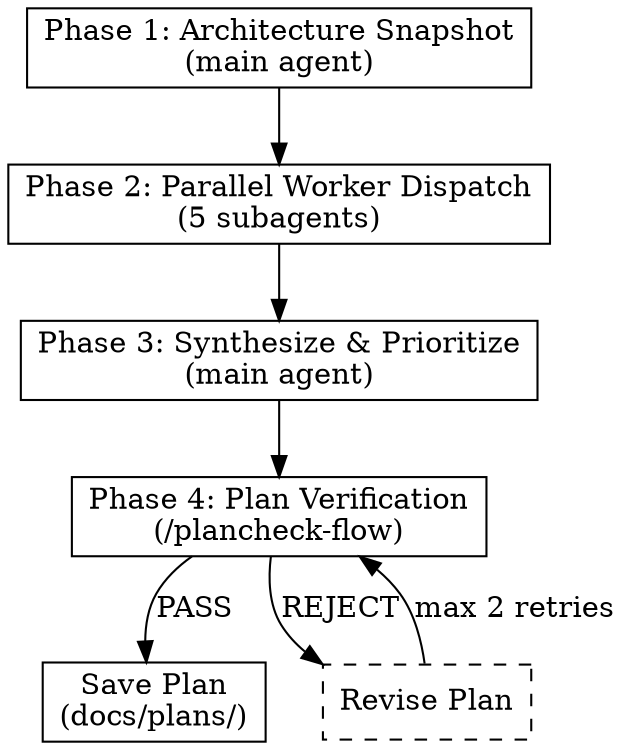

# Code Simplifier

## Overview

Scan a project for over-engineered, unnecessarily complex, or AI-agent-generated anti-pattern code. Produce a verified refactoring plan.

**Core principle:** Dispatch 5 perspective-specific workers in parallel, synthesize findings, produce a `plan-flow`-compatible plan verified by `plancheck-flow`.

**REQUIRES:** `parallel-sys` pattern, `plancheck-flow` for verification

## When to Use

- Project has accumulated complexity from AI-assisted development
- Codebase feels harder to modify than it should be
- After major feature work, before next iteration
- Periodic simplification audit (monthly/quarterly)

**Do NOT use for:**
- Security audits (separate concern)
- Performance optimization (separate concern)
- Single-file refactoring (just do it directly)

## Quick Mode (Standalone Dead Code Scan)

When invoked with `--quick` or for a single-file/directory scan, skip the full 5-worker pipeline and run a focused dead code analysis:

1. **Scan** the target path for unused imports, dead functions/classes, commented-out code, TODO/FIXME
2. **Report** findings with confidence levels
3. **No workers dispatched** — direct analysis only

### Quick Mode Checks

#### Unused Imports
- Python: `ruff check --select=F401 <path>`
- TypeScript: `biome check --reporter=summary <path>`

#### Dead Functions/Classes
- Extract definitions, check references across codebase
- Filter: magic methods, decorated functions (@app.route, @pytest.fixture), test functions, private functions
- Use `vulture <path> --min-confidence 80` if installed

#### Commented-out Code & TODOs
- Scan for commented code blocks (>3 lines)
- Search for TODO/FIXME/XXX/HACK markers

#### Empty Files
- Find empty source files

#### Long Functions (Duplication Candidates)
- Functions over 50 lines

### Quick Mode Output
```
## Dead Code Report

### Unused Imports (N)
- file.py:10 - unused import 'os'

### Dead Functions (N)
| File | Line | Function | Confidence |
|------|------|----------|------------|
| utils.py | 45 | old_helper | 90% |

### Commented-out Code (N)
### TODO/FIXME (N)

### Recommended Actions
1. Run `ruff --fix` to auto-remove unused imports
2. Review dead functions before deleting
```

For the full 5-perspective audit, invoke without `--quick`.

## The 4-Phase Process



---


## Phase 1: Architecture Snapshot

Build project context BEFORE dispatching workers. Workers need this as input.

1. **Read project structure:** `ls` source directories, count files/lines per module
2. **Read CLAUDE.md** and any docs in `docs/plans/` for architectural decisions
3. **Read config:** Settings class, env vars, entry points
4. **Map module dependencies:** Scan imports across all source files
5. **Identify conventions:** Naming patterns, error handling style, async patterns

**Output:** A text block summarizing architecture for worker prompts. Include:
- Module list with line counts
- Key architectural patterns
- Known design decisions
- Technology stack

---


## Phase 2: Dispatch 5 Workers in Parallel

Use `parallel-sys` pattern. Each worker gets the architecture snapshot + its specific analysis template.

| Worker | Template | Perspective |
|--------|----------|-------------|
| Complexity | worker-complexity.md | Functions too long, nesting too deep, abstraction bloat |
| DRY | worker-dry.md | Duplication, near-duplicates, regeneration-vs-reuse |
| YAGNI | worker-yagni.md | Premature abstraction, unused extension points, dead config |
| Dead Code | worker-dead-code.md | Unused imports/functions/classes, refactoring debris |
| Coupling | worker-coupling.md | Circular deps, god modules, hidden dependencies |

**Dispatch template:**
```
Task tool (general-purpose):
  description: "Simplify: [perspective] analysis"
  prompt: |
    [Worker template content with {PROJECT_ROOT} and {ARCHITECTURE_SNAPSHOT} filled in]
```

**All 5 workers dispatch in ONE message** (parallel execution).

---


## Phase 3: Synthesize & Prioritize

After all workers report:

### 3a. False Positive Screening

Auto-reject findings that match:
- Framework-mandated patterns (FastAPI, Pydantic, pytest fixtures)
- Domain-inherent complexity (state machines, protocol implementations)
- Acceptable test duplication
- Style preferences that don't affect maintainability
- Worker used wrong analysis (analyzed test code as production)

<HARD-GATE>
**Anti-Rationalization Rules:** These excuses do NOT justify keeping complexity:

| Rationalization | Reality |
|-----------------|---------|
| "Each file has single responsibility" | SRP doesn't justify 7 files when 1 file with clear sections suffices |
| "It's a deliberate design choice" | AI agents make deliberate-looking choices that are still over-engineered |
| "Framework-level feature" | If the "framework" was built by an AI agent for this project, it's not a real framework — evaluate if stdlib/library suffices |
| "Plausible future production surface" | YAGNI. If it's not used NOW, it's dead code. Flag it |
| "Pre-compiled so performance is fine" | Performance isn't the concern — unnecessary code is the concern |
| "Opt-out via env var exists" | Adding config for a feature nobody uses is MORE complexity, not less |
| "Senior devs would not call this over-engineered" | You are not a senior dev. Apply the checklist mechanically |

**The test:** If removing/simplifying the code preserves ALL current behavior and passes ALL tests, it's a valid simplification candidate regardless of "intent" or "design philosophy."
</HARD-GATE>

### 3b. Cross-Perspective Deduplication

Same code flagged by 2+ workers → merge into single finding:
- Keep highest severity
- Combine perspectives (e.g., "CX-3 + YG-2: logging package is both over-complex and YAGNI")
- Note which perspectives flagged it (strengthens confidence)

### 3c. Priority Scoring

| Factor | Weight | Scale |
|--------|--------|-------|
| Impact (lines eliminated, complexity reduced) | 40% | 1-5 |
| Effort (files touched, risk of breakage) | 30% | 1-5 (inverse: less effort = higher) |
| Risk (chance of behavioral change) | 30% | 1-5 (inverse: less risk = higher) |

Score = (Impact × 0.4) + (Effort × 0.3) + (Risk × 0.3)

### 3d. Group into Refactoring Units

Related findings that should be addressed together:
- Same file/module → one task
- Same architectural concern → one task
- Order by dependency (remove dead code before simplifying live code)

### 3e. Format as Refactoring Plan

Write a `plan-flow`-compatible document:
- Bite-sized tasks (2-5 min each)
- Exact file paths and code snippets
- Verification step per task (run tests, check no behavioral change)
- Estimated total lines removed

Save draft to `docs/plans/YYYY-MM-DD-simplification-plan.md`.

---


## Phase 4: Verify Plan

<HARD-GATE>
The refactoring plan MUST pass `/plancheck-flow` before being considered final. No exceptions.
</HARD-GATE>

1. Invoke `plancheck-flow` skill on the draft plan
2. If PASS → save final plan, report to user
3. If PASS WITH CHANGES → apply changes, re-save
4. If REJECT → revise plan based on feedback, re-submit (max 2 retries)
5. If still REJECT after 2 retries → report to user with reviewer concerns

---


## Output Format

Present to user after Phase 4:

```markdown
## Simplification Audit: {PROJECT_NAME}

### Summary
- Files analyzed: N
- Total findings: N (after false positive screening)
- Estimated lines removable: N
- Worker results: CX: N findings, DRY: N, YG: N, DC: N, CP: N

### Top Findings (by priority score)

1. **[Score: X.X] {Title}** — {file(s)}
   Perspectives: CX + YG | Severity: HIGH
   {Description and recommended action}

2. ...

### Refactoring Plan
Saved to: docs/plans/YYYY-MM-DD-simplification-plan.md
Review status: PASS / PASS WITH CHANGES
Ready for: `execute-flow` skill

### Discarded Findings
- {finding}: DISCARDED — {reason}
```

---


## Common Mistakes

| Mistake | Fix |
|---------|-----|
| Skipping Phase 1 (no architecture snapshot) | Workers produce low-quality findings without project context |
| Not deduplicating across workers | Same issue reported 3 times inflates severity perception |
| Flagging framework conventions as over-engineering | Always check if pattern is required by framework |
| Producing report instead of executable plan | Output MUST be `plan-flow` compatible with exact file paths |
| Skipping `/plancheck-flow` verification | HARD GATE: unverified plans may contain scope creep or bad suggestions |

## Red Flags — STOP

- Worker reports zero findings → valid outcome, report as "clean"
- All workers failed → abort, report error
- Plan exceeds 20 tasks → likely too aggressive, prioritize top 10
- Plan proposes behavior changes → simplification must preserve behavior
- **You discarded a finding that saves 100+ lines** → re-examine. Large savings = high-value target, not "framework"
- **You used the word "deliberate" or "intentional" to justify complexity** → Red flag. Re-apply checklist mechanically
- **Baseline (no-skill) analysis found more issues than your analysis** → You are being too conservative. The skill exists to find MORE, not fewer issues
