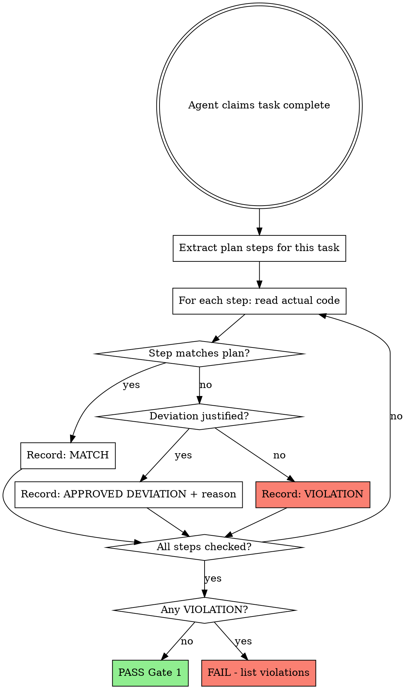

# Verifying Work

## Overview

Three verification gates before claiming completion:
1. **Gate 1 (Plan Compliance):** Did you build what was asked?
2. **Gate 2 (Execution Evidence):** Did tests/build actually pass?
3. **Gate 3 (Sprint Contract):** Does it meet the pre-negotiated contract? (skipped if no contract exists)

**Core principle:** Evidence before claims, always. An implement's report is a claim, not evidence.

**Violating the letter of this rule is violating the spirit of this rule.**

---

## Gate 1: Plan Compliance Verification

Line-by-line verification that implementation matches the plan. Not "do tests pass?" but "did you build what was asked?"

### When to Run Gate 1

- After an agent reports a plan task or batch as complete
- Before marking tasks complete
- Before moving to the next task in `execute-flow`
- When an implement's report feels vague or suspiciously quick

### The Verification Process



<HARD-GATE>
You MUST read the actual code for every plan step. Trusting the implement's report is not verification -- it's rubber-stamping.

A silent skip (step not mentioned in report, not implemented in code) is the worst violation.
</HARD-GATE>

### Step-by-Step Checklist

For EACH task in the plan:

#### 1. Step Extraction
Read the plan task. List every concrete action:
- Files to create/modify (exact paths)
- Code to write (classes, methods, signatures)
- Tests to add (test names, assertions)
- Commands to run (test, build, lint)
- Commits to make (messages)

#### 2. Code Inspection

| Check | How |
|-------|-----|
| **File exists at specified path?** | Glob/Read the file |
| **Code matches plan spec?** | Compare signatures, logic, behavior |
| **Test exists and tests the right thing?** | Read test, verify assertions match plan |
| **No silent additions?** | Check for unplanned classes, methods, files |
| **No silent removals?** | Everything in plan is present |

#### 3. Deviation Classification

| Type | Definition | Action |
|------|-----------|--------|
| **MATCH** | Code matches plan exactly or equivalently | Record, move on |
| **APPROVED DEVIATION** | Different but explicitly noted with technical justification | Record with reason |
| **SILENT DEVIATION** | Different from plan, not mentioned in report | **VIOLATION** |
| **SILENT SKIP** | Step not implemented at all, not mentioned | **VIOLATION** (worst case) |
| **UNPLANNED ADDITION** | Code added that wasn't in plan | Flag -- may be scope creep |

### Gate 1 Output Format

```markdown
## Implementation Verification: [Task Name]

**Plan steps found:** N
**Verified:** N

| # | Plan Step | Status | Notes |
|---|-----------|--------|-------|
| 1 | [step description] | MATCH / DEVIATION / SKIP | [details] |
| 2 | ... | ... | ... |

### Violations (if any)
- **SILENT SKIP:** [step] -- not implemented, not mentioned
- **SILENT DEVIATION:** [step] -- plan said X, code does Y

### Verdict
PASS / FAIL (N violations)
```

---

## Gate 2: Execution Evidence Verification

### The Iron Law

```
NO COMPLETION CLAIMS WITHOUT FRESH VERIFICATION EVIDENCE
```

If you haven't run the verification command in this message, you cannot claim it passes.

### The Gate Function

```
BEFORE claiming any status or expressing satisfaction:

1. IDENTIFY: What command proves this claim?
2. RUN: Execute the FULL command (fresh, complete)
3. READ: Full output, check exit code, count failures
4. VERIFY: Does output confirm the claim?
   - If NO: State actual status with evidence
   - If YES: State claim WITH evidence
5. ONLY THEN: Make the claim

Skip any step = lying, not verifying
```

### Common Failures

| Claim | Requires | Not Sufficient |
|-------|----------|----------------|
| Tests pass | Test command output: 0 failures | Previous run, "should pass" |
| Linter clean | Linter output: 0 errors | Partial check, extrapolation |
| Build succeeds | Build command: exit 0 | Linter passing, logs look good |
| Bug fixed | Test original symptom: passes | Code changed, assumed fixed |
| Agent completed | VCS diff shows changes | Agent reports "success" |
| Requirements met | Line-by-line checklist | Tests passing |

### Key Patterns

**Tests:**
```
[Run test command] [See: 34/34 pass] "All tests pass"
NOT: "Should pass now" / "Looks correct"
```

**Build:**
```
[Run build] [See: exit 0] "Build passes"
NOT: "Linter passed" (linter doesn't check compilation)
```

**Requirements:**
```
Re-read plan -> Create checklist -> Verify each -> Report gaps or completion
NOT: "Tests pass, phase complete"
```

---

## Gate 3: Sprint Contract Compliance

Validates that implementation meets the pre-negotiated sprint contract. Only runs if a sprint contract exists.

### When to Run Gate 3

- After Gate 2 passes
- When a sprint contract exists at `.claude/sprint-contracts/<sprint_id>.json`
- If no contract file found → skip Gate 3 (backwards compatible)

### The Verification Process

1. Read the sprint contract JSON
2. Dispatch **spec-validator** agent with:
   - The sprint contract as the spec (pass `success_criteria`, `deliverables`, `testable_behaviors`)
   - The implementation files to validate against
3. Evaluate spec-validator output:
   - All `success_criteria` items must be **IMPLEMENTED**
   - All `deliverables` must be **IMPLEMENTED**
   - No **MISSING** items allowed for PASS
   - **PARTIAL** items → FAIL (must be fully met)
   - **OVER-IMPLEMENTED** items → flag as warning (possible scope creep vs `scope_boundaries`)
4. Check `scope_boundaries` — any work done outside declared scope is a violation

### Gate 3 Output Format

```markdown
## Sprint Contract Verification: [sprint_id]

**Contract:** [feature description]
**Deliverables:** N total, N implemented
**Success Criteria:** N total, N met

| # | Criterion | Status | Evidence |
|---|-----------|--------|----------|
| 1 | [criterion] | IMPLEMENTED / MISSING / PARTIAL | [file:line or test output] |

### Scope Check
- Scope violations: [list or "none"]
- Over-implementation warnings: [list or "none"]

### Verdict
PASS / FAIL (N criteria unmet, N scope violations)
```

### Gate 3 PASS Requirements

- All `success_criteria`: IMPLEMENTED
- All `deliverables`: IMPLEMENTED
- Zero scope violations
- Over-implementation: warning only (does not block PASS)

---

## Red Flags - STOP

- Using "should", "probably", "seems to"
- Expressing satisfaction before verification
- About to commit/push/PR without verification
- Trusting agent success reports
- Relying on partial verification
- "Tests pass so it must be right" (tests verify behavior, not plan compliance)

### Red Flag Phrases in Implementer Reports

| Phrase | What it likely means |
|--------|---------------------|
| "Done!" / "All done!" | Skipped details -- verify everything |
| "Implemented with minor adjustments" | Changed approach -- verify what changed |
| "Slightly different approach" | Deviated from plan -- check scope |
| "Also added..." | Unplanned work -- check scope creep |
| No mention of a specific task step | Silently skipped -- verify immediately |
| "Tests pass" without listing them | May not have written planned tests |

## Rationalization Prevention

| Excuse | Reality |
|--------|---------|
| "Should work now" | RUN the verification |
| "I'm confident" | Confidence =/= evidence |
| "Close enough" | Deviations compound -- verify exactly |
| "Agent said success" | Verify independently |
| "Too many steps to check" | Batch them -- but check every one |

## Integration

**Execution flow:**
```
plancheck-flow -> execute plan -> verify-anly -> commit/merge
```

**Called by:**
- **execute-flow** - After each task/batch
- **debug-anly** - Verify fix before claiming success
- Any workflow before claiming completion

## The Bottom Line

**No shortcuts for verification.**

Gate 1: Read the code. Check the plan. Count the steps.
Gate 2: Run the command. Read the output. THEN claim the result.
Gate 3: Check the contract. Every criterion met. No scope violations.

This is non-negotiable.
